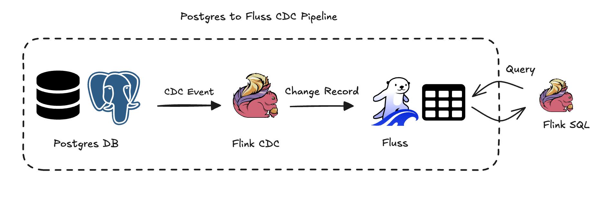
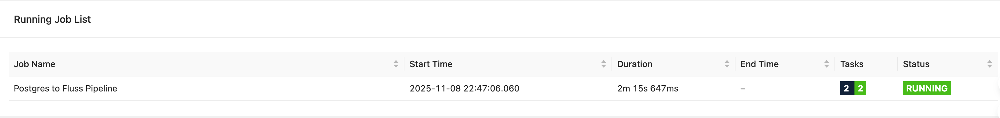

# From Postgres to Fluss: A CDC Pipeline in Action

The world of real-time data just got more interesting! Fluss is growing up fast, with a passionate community building a rich ecosystem around it. Think of Fluss as a high-performance home for your streaming data, built for analytics. So, what's one of the most useful things you can do with it? Keeping a live pulse on your database changes, of course!

That's exactly why the Flink CDC community built a brand-new connector for Fluss. In this guide, we're going to get our hands dirty and use it to build a live pipeline that grabs changes from a PostgreSQL database and streams them directly into Fluss.

Ready to see it in action? The diagram below shows our target setup. Let's dive in!



## Prerequisite

### Postgres and Fluss

We can use the following `docker-compose.yaml` to quickly start a Postgres server and Fluss server.

```sql
services:
    #begin Fluss cluster
    coordinator-server:
      image: fluss/fluss:0.7.0
      command: coordinatorServer
      depends_on:
        - zookeeper
      environment:
        - |
          FLUSS_PROPERTIES=
          zookeeper.address: zookeeper:2181
          bind.listeners: INTERNAL://coordinator-server:0, CLIENT://coordinator-server:9123
          advertised.listeners: CLIENT://localhost:9123
          internal.listener.name: INTERNAL
          remote.data.dir: /tmp/fluss/remote-data
          # security properties
          security.protocol.map: CLIENT:PLAINTEXT, INTERNAL:PLAINTEXT
          super.users: User:admin
      ports:
        - "9123:9123"
    tablet-server:
      image: fluss/fluss:0.7.0
      command: tabletServer
      depends_on:
        - coordinator-server
      environment:
        - |
          FLUSS_PROPERTIES=
          zookeeper.address: zookeeper:2181
          bind.listeners: INTERNAL://tablet-server:0, CLIENT://tablet-server:9123
          advertised.listeners: CLIENT://localhost:9124
          internal.listener.name: INTERNAL
          tablet-server.id: 0
          kv.snapshot.interval: 0s
          data.dir: /tmp/fluss/data
          remote.data.dir: /tmp/fluss/remote-data
          # security properties
          security.protocol.map: CLIENT:PLAINTEXT, INTERNAL:PLAINTEXT
          super.users: User:admin
      ports:
        - "9124:9123"
    zookeeper:
      restart: always
      image: zookeeper:3.9.2
    #end
    # postgres
    postgres:
      image: postgres:14.5
      container_name: my_postgres
      environment:
        POSTGRES_USER: postgres
        POSTGRES_PASSWORD: postgres
        POSTGRES_DB: postgres
      ports:
        - "5432:5432"
      volumes:
        - postgres_data:/var/lib/postgresql/data
      command:
        - "postgres"
        - "-c"
        - "wal_level=logical"
        - "-c"
        - "max_replication_slots=5"
        - "-c"
        - "max_wal_senders=5"
        - "-c"
        - "hot_standby=on"
    # end
volumes:
  postgres_data:
```

Run

```sql
docker-compose up -d
```

to start Postgres and Fluss containers.


### Flink

Prepare a local Flink cluster to run the CDC and query jobs.

**Step 1: Download Flink 1.20**

Grab the flink 1.20.3 binary package from the [Flink downloads page](https://flink.apache.org/downloads/).

**Step 2: Add the Fluss Connector**

Download `fluss-flink-1.20-0.7.0.jar` from the [Fluss site](https://alibaba.github.io/fluss-docs/downloads/) and copy it into `${FLINK_HOME}/lib`
**Step 3: Flink Configuration**

Edit `<FLINK_HOME>/conf/config.yaml`:

```java
// increase the slots number to 5
numberOfTaskSlots: 5 

// enable checkpoint and set the interval to 3s
execution:
  checkpointing:
    interval: 3s
```

**Step 4: Start flink cluster**

```java
<FLINK_HOME>/bin/start-cluster.sh
```

**Step 5: Verify**

Open your browser to `http://localhost:8081/` and confirm the cluster is up.

### Flink CDC

**Step1: Download Flink CDC library.**

Download [flink-cdc-3.5.0](https://www.apache.org/dyn/closer.lua/flink/flink-cdc-3.5.0/flink-cdc-3.5.0-bin.tar.gz). Extract them to a directory `flink-cdc-3.5.0`. There will be four folders in it: bin, conf, lib log.

**Step2: Download CDC connectors.**
Visit the [official website](https://nightlies.apache.org/flink/flink-cdc-docs-release-3.5/docs/connectors/pipeline-connectors/overview/) to download the Postgres and Fluss CDC connector JARs for version `3.5.0`. Place them into the `flink-cdc-3.5.0/lib` directory. The contents should look like this:

```sql
flink-cdc-3.5.0/lib ❯ tree .                                         
.
├── flink-cdc-dist-3.5.0.jar
├── flink-cdc-pipeline-connector-fluss-3.5.0.jar
└── flink-cdc-pipeline-connector-postgres-3.5.0.jar
```

**Step3: Set the `FLINK_HOME` environment variable.**

```sql
export FLINK_HOME=/path/to/flink-1.20.3 
```

Excellent! All components are now set up. Let's build our pipelines.

## Build Postgres to Fluss CDC Pipeline

### Postgres

First, enter the my_postgres container and login.

```sql
docker exec -it my_postgres /bin/bash

# in postgres container 
psql -U postgres
```

Then create a table named `orders` in PostgreSQL. We will capture data changes from this table.

```java
CREATE TABLE orders (
    order_id INT PRIMARY KEY,
    customer_name VARCHAR(100) NOT NULL,
    order_date DATE NOT NULL DEFAULT CURRENT_DATE,
    total_amount DECIMAL(10,2) NOT NULL
);
```

This table is typically created in the default `postgres` database. You can check the schema with the following command:

```sql
# Execute in PostgresSQL
postgres=# \dt

# result
         List of relations
 Schema |  Name  | Type  |  Owner
--------+--------+-------+----------
 public | orders | table | postgres
```

The fully qualified table name `{database}.{schema}.{table_name}` in PostgreSQL is `postgres.public.orders`.

### Flink CDC

Flink CDC provides command-line tools to simplify pipeline creation. The entire pipeline can be defined in a YAML file. In this case, we will capture data changes from PostgreSQL and sink them into Fluss. Create a file named `postgres-to-fluss.yaml` with the following content:

```sql
# postgres-to-fluss.yaml
source:
   type: postgres
   name: Postgres Source
   hostname: 127.0.0.1
   port: 5432
   username: postgres
   password: postgres
   tables: postgres.public.orders
   decoding.plugin.name:  pgoutput
   slot.name: pgtest

sink:
  type: fluss
  name: Fluss Sink
  bootstrap.servers: localhost:9123
  # Security-related properties for the Fluss client
  properties.client.security.protocol: PLAINTEXT

pipeline:
   name: Postgres to Fluss Pipeline
   parallelism: 1
```

Navigate to the `flink-cdc-3.5.0` directory and run the following command:

```sql
# run command
flink-cdc-3.5.0 ❯ bin/flink-cdc.sh postgres-to-fluss.yaml

# result
Pipeline has been submitted to cluster.
Job ID: 52cf6c5a6a3b16a7e8faae0b8586fa86
Job Description: Postgres to Fluss Pipeline
```

This will submit a Flink job named `Postgres to Fluss Pipeline` to the cluster.



Now we have completed the CDC pipeline from Postgres to Fluss.

### Flink SQL Client

Finally, we can start a simple Flink job to query the Fluss table and verify that the CDC data has been ingested.

Start the Flink SQL client:

```sql
${FLINK_HOME}/bin/sql-client.sh
```

Execute the following commands in the Flink SQL client:

```sql
-- Flink SQL 
CREATE CATALOG fluss_catalog WITH (
    'type' = 'fluss',   
    'bootstrap.servers' = 'localhost:9123'
);

USE CATALOG fluss_catalog;

SET 'execution.runtime-mode' = 'streaming';
SET 'sql-client.execution.result-mode' = 'tableau';
```

The Fluss table is automatically created by the Fluss CDC connector. Let's verify it:

```sql
Flink SQL> show databases;
+---------------+
| database name |
+---------------+
|         fluss |
|        public |
+---------------+
2 rows in set

Flink SQL> show tables from public;
+------------+
| table name |
+------------+
|     orders |
+------------+
1 row in set
```

We can see the CDC table is located in a database named `public`. Thus, the full name of the Fluss table `{database}.{table_name}` is `public.orders`.

We can run a simple query to inspect the table. Initially, no results will appear because the source PostgreSQL table is empty and no changes have occurred yet.

Notice that there is an additional column `op` comparing to the original Postgres table.

```sql
Flink SQL> SELECT * FROM public.orders;
+----+-------------+--------------------------------+------------+--------------+
| op |    order_id |                  customer_name | order_date | total_amount |
+----+-------------+--------------------------------+------------+--------------+
```

## Capture Data Change

Let's insert some values into the PostgreSQL table to generate change events.

```java
# Execute in PostgresSQL. 
# Insert 5 rows
INSERT INTO orders (order_id, customer_name, order_date, total_amount) VALUES
(1001, 'John Smith', '2024-01-15', 299.99),
(1002, 'Emma Johnson', '2024-01-16', 150.50),
(1003, 'Michael Brown', '2024-01-17', 89.99),
(1004, 'Sarah Davis', '2024-01-18', 450.00),
(1005, 'David Wilson', '2024-01-19', 199.99)
```

If we return to the Flink SQL client, we can see that the data changes have been captured and stored in the Fluss table. The `op` column indicates the operation type: `+I` for insert, `-U`/`+U` for update, `-D` for delete.

```sql
Flink SQL> select * from public.orders;
+----+-------------+--------------------------------+------------+--------------+
| op |    order_id |                  customer_name | order_date | total_amount |
+----+-------------+--------------------------------+------------+--------------+
| +I |        1001 |                     John Smith | 2024-01-15 |       299.99 |
| +I |        1002 |                   Emma Johnson | 2024-01-16 |       150.50 |
| +I |        1003 |                  Michael Brown | 2024-01-17 |        89.99 |
| +I |        1004 |                    Sarah Davis | 2024-01-18 |       450.00 |
| +I |        1005 |                   David Wilson | 2024-01-19 |       199.99 |
```

Great! The CDC pipeline is working correctly. Let's test a delete operation.

```sql
# Execute in PostgresSQL
# Delete 1 row
DELETE FROM orders where order_id = '1004';
```

A `-D` row will be added to the Fluss table for the deleted record.

```sql
Flink SQL> select * from public.orders;
+----+-------------+--------------------------------+------------+--------------+
| op |    order_id |                  customer_name | order_date | total_amount |
+----+-------------+--------------------------------+------------+--------------+
| +I |        1001 |                     John Smith | 2024-01-15 |       299.99 |
| +I |        1002 |                   Emma Johnson | 2024-01-16 |       150.50 |
| +I |        1003 |                  Michael Brown | 2024-01-17 |        89.99 |
| +I |        1004 |                    Sarah Davis | 2024-01-18 |       450.00 |
| +I |        1005 |                   David Wilson | 2024-01-19 |       199.99 |
| -D |        1004 |                    Sarah Davis | 2024-01-18 |       450.00 |
```

Nice! How about updating? Let’s try.

```sql
UPDATE orders SET customer_name = 'Alice Scott' where order_id = '1005';
```

We can see the `-U/+U` records appended to the Fluss table.

```sql
Flink SQL> select * from public.orders;
+----+-------------+--------------------------------+------------+--------------+
| op |    order_id |                  customer_name | order_date | total_amount |
+----+-------------+--------------------------------+------------+--------------+
| +I |        1001 |                     John Smith | 2024-01-15 |       299.99 |
| +I |        1002 |                   Emma Johnson | 2024-01-16 |       150.50 |
| +I |        1003 |                  Michael Brown | 2024-01-17 |        89.99 |
| +I |        1004 |                    Sarah Davis | 2024-01-18 |       450.00 |
| +I |        1005 |                   David Wilson | 2024-01-19 |       199.99 |
| -D |        1004 |                    Sarah Davis | 2024-01-18 |       450.00 |
| -U |        1005 |                   David Wilson | 2024-01-19 |       199.99 |
| +U |        1005 |                    Alice Scott | 2024-01-19 |       199.99 |
```

And there you have it! We've successfully seen our pipeline in action, capturing inserts, updates, and deletes in real-time and reflecting them precisely within Fluss.

## **Wrapping Up**

And that's a wrap! 🎉

We've successfully built a pipeline that captures every single change in a Postgres database and streams it live into Fluss. From a simple `INSERT` to an `UPDATE` or `DELETE`, you can see how seamlessly the data flows, allowing you to query the latest state in real-time.

This hands-on example gives you a taste of what's possible with Fluss as your streaming data storage. It makes capturing and working with real-time data changes feel natural and straightforward. And remember, this is just the beginning!

Imagine using this steady stream of real-time data to:

- Build live-updating analytics dashboards.
- Feed complex, real-time machine learning models.
- Power responsive and event-driven applications.

The world of Fluss is just opening up, with many more powerful features waiting for you to explore. So why not dive in? Head over to the [Fluss GitHub](https://github.com/apache/fluss), get your hands dirty, and see what you can build!

If you have any ideas, questions, or just want to share what you've built, the community is waiting. Let's build the future of streaming data together!

Happy Streaming! 🚀